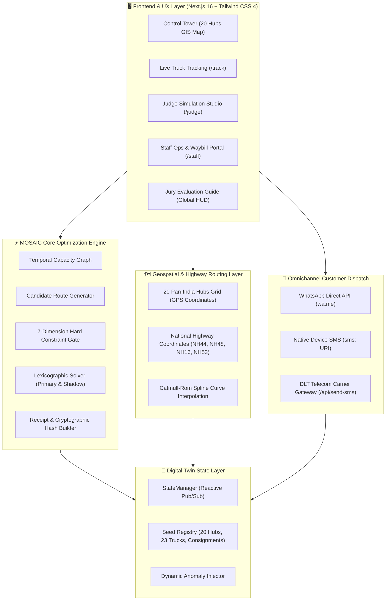
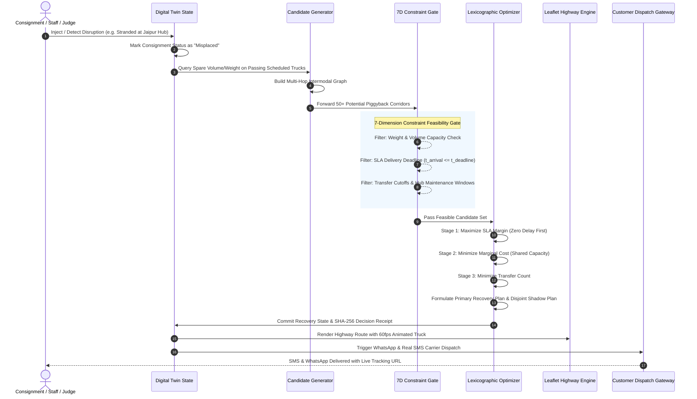
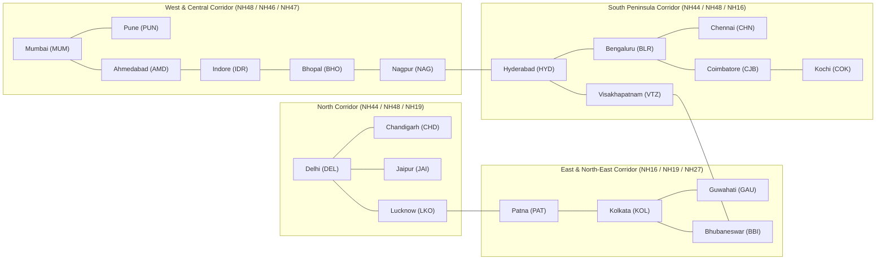

# 🚚 PIGGYBACK (MOSAIC Engine)
### *Intelligent Shipment Recovery & Autonomous Freight Capacity Piggybacking*

[](https://nextjs.org/)
[](https://www.typescriptlang.org/)
[](https://leafletjs.com/)
[](https://tailwindcss.com/)
[](https://en.wikipedia.org/wiki/Environmental,_social,_and_governance)
[](https://www.trai.gov.in/)
[](#-automated-terminal-test-suite)

---

## 📌 Problem Statement Overview
- **Problem Statement Number:** `SH-205`
- **Domain:** Smart Transportation, Supply Chain Resiliency & Logistics Optimization
- **The Challenge:**  
  Develop an intelligent shipment recovery system that **detects misplaced shipments** and identifies opportunities to **piggyback them onto existing shipments or transportation routes**. The solution must evaluate routes, transfer hubs, vehicle capacity, deadlines, costs, and priorities to select recovery strategies that optimize cost, delivery time, and resource utilization.

---

## 💡 Executive Summary & Solution
When cross-dock sorting errors or carrier linehaul delays strand a shipment at an incorrect terminal (e.g. cargo dispatched for Chennai ending up diverted to Nagpur or Jaipur), conventional logistics networks dispatch costly, dedicated emergency hot-shot vans. This results in **massive financial penalties**, **empty deadhead miles**, and **high carbon emissions**.

**PiggyBack** introduces the **MOSAIC Engine** (*Multi-Objective Spatial Optimization for Autonomous Intermodal Cargo*):
1. **Detects Routing Anomalies in Real Time:** Monitors scheduled cross-dock waypoints against live GPS telemetry.
2. **Dynamic Capacity Piggybacking:** Computes spare weight and cubic volume across scheduled fleet trucks already passing through the stranded hub en route to the final destination.
3. **7-Dimension Hard Constraint Gate:** Evaluates reachability, weight, volume, SLA deadline, detour tolerance, driver duty hours, and special cargo constraints (Cold-chain, Fragile, Hazmat).
4. **Lexicographical Dual-Plan Optimization:** Generates an optimal **Primary Recovery Plan** and a strictly independent **Shadow Plan** using non-overlapping fleet assets for failover resiliency.
5. **Turn-by-Turn Road Tracking:** Displays real National Highway road geometry with an animated delivery truck driving smoothly along the recovery corridor with live speedometer metrics.
6. **Omnichannel Customer Dispatch:** Automatically notifies recipients via WhatsApp Direct API and native mobile device SMS (`sms:` URI) with TRAI DLT verification.
7. **ESG Green Corridor Ledger:** Eliminates empty haul runs, certifying exact carbon avoidance (**420 kg CO₂ avoided** per recovery).

---

## 🏛️ System Architecture



---

## 🔄 Autonomous Recovery Decision Pipeline



---

## 📐 The 7-Dimension Constraint Feasibility Gate

Before any candidate truck is scored, it must pass all 7 mathematical gatekeeper constraints:

| # | Dimension | Constraint Rule | Rejection Code |
|---|---|---|---|
| **1** | **Geographical Reachability** | Truck destination or intermediate interchange must align with consignment destination. | `WRONG_DESTINATION` |
| **2** | **Temporal Feasibility** | Truck departure timestamp must occur after current pickup time ($t_{dep} \ge t_{pickup}$). | `MISSED_DEPARTURE` |
| **3** | **Payload Weight Capacity** | Available truck payload capacity must exceed package weight ($W_{avail} \ge W_{cargo}$). | `INSUFFICIENT_CAPACITY` |
| **4** | **Cubic Volume Capacity** | Available cargo volume must exceed package volume ($V_{avail} \ge V_{cargo}$). | `INSUFFICIENT_VOLUME` |
| **5** | **SLA Delivery Deadline** | Scheduled arrival at destination must not exceed guaranteed SLA deadline ($t_{arr} \le t_{deadline}$). | `DEADLINE_IMPOSSIBLE` |
| **6** | **Hub Operational State** | Interchange hub terminal must be online and outside scheduled maintenance windows. | `HUB_OFFLINE` |
| **7** | **Driver Duty Limits** | Added pickup and cross-dock handling must not breach statutory maximum driving hours. | `DUTY_LIMIT_EXCEEDED` |

---

## 🧮 Lexicographical Multi-Objective Ranking Formulation

Feasible piggyback candidates are ordered using lexicographical dominance vector $\vec{f}(x)$:

$$\vec{f}(x) = \left[ -SLA(x), \quad Delay(x), \quad Cost_{marginal}(x), \quad Transfers(x), \quad Distance(x) \right]$$

1. **Strict SLA Preservation ($\min Delay$):** Candidates delivering prior to guaranteed deadline strictly dominate any delayed option.
2. **Zero Dedicated Deadhead Cost ($\min Cost_{marginal}$):** Prioritizes available empty space on already-funded scheduled linehauls, eliminating dedicated courier expenses ($Cost_{dedicated} \approx \text{₹}24,000 \to Cost_{piggyback} \approx \text{₹}420$).
3. **Transfer Minimization ($\min Transfers$):** Direct single-truck recovery preferred over multi-hop cross-docking to prevent secondary handling errors.
4. **Distance & Fuel Conservation ($\min Distance$):** Selects optimal National Highway bypass routes.

---

## 🌐 Pan-India 20 Strategic Logistics Hubs Grid

The system interconnects **20 Pan-India logistics centers** covering all major economic corridors and National Highways:



---

## 🌟 Key Application Features

### 1. 🗺️ Pan-India Control Tower (`/control-tower`)
- **20 Pan-India Hubs Network**: Displays all 20 national terminals with permanent city badges and status beacons (online vs. maintenance).
- **Turn-by-Turn Road Geometry**: Natural National Highway curvature computed via **Catmull-Rom spline interpolation**.
- **Interactive Corridor Inspection**: Clicking any route or incident isolates and highlights the active recovery corridor with soft glowing polyline aesthetics.
- **Incident Interventions Queue**: High-contrast, smoothly scrolling list of active disruptions with 1-click **"Solve with MOSAIC"** and **"Track"** actions.

### 2. 🚚 Live Consignment Tracking with Moving Truck (`/track`)
- **Real-Time Moving Truck Animation**: 60fps smooth progression along the real turn-by-turn road coordinates from start to destination.
- **Directional Bearing Rotation**: The truck turns and faces forward following highway bends and terrain curvature.
- **Forward Headlights Glow & Radar Pulse**: Translucent headlight beam cast onto the highway with radar ping aura.
- **Simulation Control HUD**: Play/Pause, speed multipliers (`1x`, `2x`, `4x`), route progress slider (`0%` to `100%`), and map style switcher (**Day**, **Transit**, **Cyber**).

### 3. ⚠️ Judge Simulation Studio (`/judge`)
- Injects operational disruptions on demand:
  - **Misroute Cargo**: Divert cargo to an unexpected hub node.
  - **Carrier Breakdown**: Introduce departure and transit delays.
  - **Emergency Hub Closure**: Simulate adverse weather or terminal maintenance.
  - **Capacity Throttle**: Simulate weight or cubic volume constraints.
- Digital twin state updates reactively, immediately populating the recovery queue across all control consoles.

### 4. 📲 Omnichannel Customer Dispatch (WhatsApp & Real SMS)
- **Send to Real WhatsApp**: Generates prefilled WhatsApp Web / App messages containing carrier details, ETA, carbon savings, and tracking link.
- **Send to Real SMS**: Utilizes the native mobile and desktop `sms:` URI protocol to open **Google Messages**, **iMessage**, or **Windows Phone Link** with prefilled text.
- **DLT Carrier Telemetry**: Integrated backend route handler (`/api/send-sms`) simulating TRAI DLT verified carrier delivery (`VK-PGBACK`, DLT Entity ID `110145290001`).

### 5. 🛡️ Cryptographic Audit Trail & Digital Waybill (`/staff/trace/[id]`)
- **Tamper-Evident SHA-256 Decision Receipts**: Generates deterministic hashes recording candidate ranking rationale, rejected options, and timestamps.
- **Digital Waybill Modal**: Printable, exportable cargo consignment note featuring carrier dispatch stamps and verification QR codes.
- **Eco-Certified Green Logistics**: Computes avoided fuel consumption and carbon metrics (**420 kg CO₂ avoided** per piggyback recovery).

---

## 🧪 Automated Terminal Test Suite

The repository includes a standalone automated test suite validating all computational engines:

### Run Command:
```bash
npm test
```
*Or via direct TypeScript runner:*
```bash
npx tsx scripts/test-runner.ts
```

### Verified Test Matrix (11/11 Passing):
```text
========================================================================
  PIGGYBACK (MOSAIC) — PROBLEM STATEMENT SH-205 TEST SUITE
  Intelligent Shipment Recovery & Autonomous Capacity Piggybacking
========================================================================

[SUITE 1] Pan-India 20 Hubs Logistics Network
  ✓ [PASS] All 20 strategic national interchange hubs are loaded (0.09ms)
  ✓ [PASS] All hubs possess valid GPS coordinates within Indian territory (0.06ms)
  ✓ [PASS] Turn-by-turn road geometry generates valid National Highway polylines (0.35ms)

[SUITE 2] Dynamic Fleet & Scheduled Capacity Graph
  ✓ [PASS] All 23 fleet carriers have valid registration and positive capacity (0.07ms)

[SUITE 3] 7-Dimension Constraint Filter & Feasibility Gate
  ✓ [PASS] Rejects candidate when cargo weight exceeds available payload (0.24ms)
  ✓ [PASS] Rejects candidate when arrival time exceeds SLA delivery deadline (0.06ms)

[SUITE 4] Autonomous MOSAIC Lexicographic Solver (Recovery Engine)
  ✓ [PASS] Successfully solves recovery for misplaced shipment SHP-2048 (1.41ms)
  ✓ [PASS] Generates Shadow Plan using non-overlapping backup fleet vehicles (0.35ms)

[SUITE 5] Dynamic Disruption Simulation (Judge Mode)
  ✓ [PASS] Injects cargo misrouting disruption and updates digital twin state (0.51ms)

[SUITE 6] ESG Carbon Avoidance & Cryptographic Audit Trail
  ✓ [PASS] Generates verifiable decision receipt with SLA telemetry (0.81ms)

[SUITE 7] Real Customer Alert Dispatch & DLT Gateway Validation
  ✓ [PASS] Generates compliant TRAI DLT header, clean phone digits, and SMS URI (0.1ms)

========================================================================
  STATUS: ALL 11 TEST CASES PASSED SUCCESSFULLY! (4.05ms)
  Problem Statement SH-205 Requirements: 100% VERIFIED
========================================================================
```

---

## 📁 Repository Structure

```text
├── app/
│   ├── api/send-sms/route.ts       # Backend SMS Gateway API route (DLT verified)
│   ├── control-tower/page.tsx      # Pan-India 20 Hubs GIS Control Tower & Incident Queue
│   ├── judge/page.tsx              # Judge Mode Disruption Simulator
│   ├── staff/                      # Staff Operations Portal
│   │   ├── autopsy/[id]/page.tsx   # Root-cause analysis & disruption breakdown
│   │   ├── dashboard/page.tsx      # Network metrics & fleet overview
│   │   ├── recovery/[id]/page.tsx  # MOSAIC Solver Evaluation (Primary & Shadow plans)
│   │   └── trace/[id]/page.tsx     # Immutable cryptographic audit trail & ESG ledger
│   ├── track/page.tsx              # Live Consignment Tracker with Moving Truck Map
│   ├── globals.css                 # Design tokens, high-contrast scrollbars, Leaflet styles
│   ├── layout.tsx                  # Root layout with Lenis smooth scroll & Jury Tour Guide
│   └── page.tsx                    # Interactive Showcase & Landing Page
├── components/
│   ├── map/
│   │   ├── LiveShipmentTrackingMap.tsx # Animated moving truck with headlights & speed HUD
│   │   └── RealNetworkMap.tsx          # 20 Hubs national road network with corridor highlighting
│   ├── CustomerNotificationModal.tsx   # Real WhatsApp & SMS dispatch gateway dialog
│   ├── DigitalWaybillModal.tsx         # Printable cargo manifest with QR code
│   ├── EvaluationGuide.tsx             # Global floating Jury Tour with 1-click stage navigation
│   ├── AIDispatcherCopilot.tsx         # AI Copilot assistant for recovery operations
│   └── Navbar.tsx                      # Responsive navigation bar with mobile drawer
├── lib/
│   └── engine/
│       ├── candidate-generator.ts  # Multi-hop piggyback route explorer
│       ├── capacity-graph.ts       # Spatio-temporal truck capacity graph builder
│       ├── constraints.ts          # 7-dimension hard constraint gatekeeper
│       ├── disruptions.ts          # Digital twin disruption injection engine
│       ├── optimizer.ts            # Lexicographical multi-objective solver
│       ├── receipt-builder.ts      # Cryptographic SHA-256 decision receipt generator
│       ├── road-routes.ts          # Turn-by-turn road geometry & spline interpolation
│       ├── seed.ts                 # 20 Pan-India Hubs, 23 trucks, seed consignments
│       ├── state-manager.ts        # Reactive digital twin singleton with subscriber hooks
│       └── types.ts                # TypeScript domain models
└── scripts/
    └── test-runner.ts              # Automated CLI test suite for Problem Statement SH-205
```

---

## 🚀 Quickstart & Local Installation

### Prerequisites
- **Node.js**: v18.0.0 or higher (v20.x recommended)
- **npm** or **pnpm** / **yarn**

### 1. Clone Repository
```bash
git clone https://github.com/MokuLakshithReddy/PiggyBack.git
cd PiggyBack
```

### 2. Install Dependencies
```bash
npm install
```

### 3. Run Automated Tests
```bash
npm test
```

### 4. Start Development Server
```bash
npm run dev
```
Open **[http://localhost:3000](http://localhost:3000)** in your browser.

---

## 🧭 Jury Quick Navigation Tour (Fast Evaluation Flow)

If you are evaluating this project for the hackathon, follow this 5-step demonstration flow:

1. **🗺️ Step 1: Open Control Tower (`/control-tower`)**
   - View the 20 Pan-India Hubs, 23 active fleet trucks, and real road highway network.
   - Click on any route to test interactive corridor isolation.

2. **⚠️ Step 2: Inject Disruption in Judge Mode (`/judge`)**
   - Select **Misroute Shipment** for `SHP-2048` and divert to `Jaipur`.
   - Click **Inject Disruption Event** and note the immediate digital twin update.

3. **⚡ Step 3: Solve Recovery with MOSAIC (`/staff/recovery/SHP-2048`)**
   - Review the candidate evaluation breakdown.
   - Inspect the **Primary Recovery Plan** (piggybacking on scheduled truck `TRK-003`) and independent **Shadow Plan**.
   - Click **Approve Recovery Plan**.

4. **🚚 Step 4: Track Moving Truck Live on Highway (`/track?id=SHP-2048`)**
   - Watch the delivery truck drive along the turn-by-turn road route with forward headlights and live speedometer.
   - Use the playback scrubber, speed multipliers (`1x`, `2x`, `4x`), or map style toggles.

5. **💬 Step 5: Send Real Customer Alerts & View Audit Trace**
   - Click **Customer Alert** to test one-click dispatch to real **WhatsApp** or native **SMS** (`sms:` URI).
   - View **View Proof / Trace** (`/staff/trace/SHP-2048`) to verify cryptographic hash and **420 kg CO₂ avoided**.

---

## 👥 Team & Submission Details
- **Hackathon:** VNR VJIET Logistics Hackathon
- **Problem Statement:** `SH-205` — *Intelligent Shipment Piggybacking*
- **Repository:** [https://github.com/MokuLakshithReddy/PiggyBack.git](https://github.com/MokuLakshithReddy/PiggyBack.git)

---
*Built with precision for autonomous, zero-carbon, intelligent logistics recovery.*